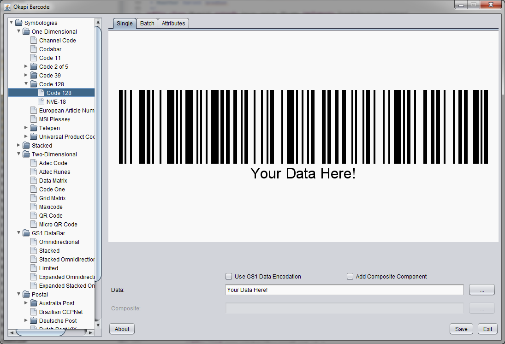

# Okapi Barcode [](http://www.apache.org/licenses/LICENSE-2.0.html) [](https://maven-badges.herokuapp.com/maven-central/uk.org.okapibarcode/okapibarcode) [](https://travis-ci.org/woo-j/OkapiBarcode)

Okapi Barcode is an open-source barcode generator written entirely in Java,
supporting over 50 encoding standards, including all ISO standards. Okapi
Barcode is based on [Zint](https://sourceforge.net/projects/zint/), an
open-source barcode encoding library developed in C, and builds on the years
of work that have been invested in that project.

### Supported Symbologies

* [Australia Post](src/main/java/uk/org/okapibarcode/backend/AustraliaPost.java) variants:
  * Standard Customer
  * Reply Paid
  * Routing
  * Redirection
* [Aztec Code](src/main/java/uk/org/okapibarcode/backend/AztecCode.java)
* [Aztec Runes](src/main/java/uk/org/okapibarcode/backend/AztecRune.java)
* [Channel Code](src/main/java/uk/org/okapibarcode/backend/ChannelCode.java)
* [Codabar](src/main/java/uk/org/okapibarcode/backend/Codabar.java)
* [Codablock F](src/main/java/uk/org/okapibarcode/backend/CodablockF.java)
* [Code 11](src/main/java/uk/org/okapibarcode/backend/Code11.java)
* [Code 128](src/main/java/uk/org/okapibarcode/backend/Code128.java)
* [Code 16k](src/main/java/uk/org/okapibarcode/backend/Code16k.java)
* [Code 2 of 5](src/main/java/uk/org/okapibarcode/backend/Code2Of5.java) variants:
  * Matrix 2 of 5
  * Industrial 2 of 5
  * IATA 2 of 5
  * Datalogic 2 of 5
  * Interleaved 2 of 5
  * ITF-14
  * Deutsche Post Leitcode
  * Deutsche Post Identcode
* [Code 32](src/main/java/uk/org/okapibarcode/backend/Code32.java) (Italian pharmacode)
* [Code 3 of 9](src/main/java/uk/org/okapibarcode/backend/Code3Of9.java) (Code 39)
* [Code 3 of 9 Extended](src/main/java/uk/org/okapibarcode/backend/Code3Of9Extended.java) (Code 39 Extended)
* [Code 49](src/main/java/uk/org/okapibarcode/backend/Code49.java)
* [Code 93](src/main/java/uk/org/okapibarcode/backend/Code93.java)
* [Code One](src/main/java/uk/org/okapibarcode/backend/CodeOne.java)
* [Composite](src/main/java/uk/org/okapibarcode/backend/Composite.java)
* [Data Matrix](src/main/java/uk/org/okapibarcode/backend/DataMatrix.java)
* [Dutch Post KIX Code](src/main/java/uk/org/okapibarcode/backend/KixCode.java)
* [EAN](src/main/java/uk/org/okapibarcode/backend/Ean.java) variants:
  * EAN-13
  * EAN-8
* [Grid Matrix](src/main/java/uk/org/okapibarcode/backend/GridMatrix.java)
* [GS1 DataBar](src/main/java/uk/org/okapibarcode/backend/DataBar14.java) variants:
  * GS1 DataBar
  * GS1 DataBar Stacked
  * GS1 DataBar Stacked Omnidirectional
* [GS1 DataBar Expanded](src/main/java/uk/org/okapibarcode/backend/DataBarExpanded.java) variants:
  * GS1 DataBar Expanded
  * GS1 DataBar Expanded Stacked
* [GS1 DataBar Limited](src/main/java/uk/org/okapibarcode/backend/DataBarLimited.java)
* [Japan Post](src/main/java/uk/org/okapibarcode/backend/JapanPost.java)
* [Korea Post](src/main/java/uk/org/okapibarcode/backend/KoreaPost.java)
* [LOGMARS](src/main/java/uk/org/okapibarcode/backend/Logmars.java)
* [MaxiCode](src/main/java/uk/org/okapibarcode/backend/MaxiCode.java)
* [MSI](src/main/java/uk/org/okapibarcode/backend/MsiPlessey.java) (Modified Plessey)
* [PDF417](src/main/java/uk/org/okapibarcode/backend/Pdf417.java) variants:
  * PDF417
  * Truncated PDF417
  * Micro PDF417
* [Pharmacode](src/main/java/uk/org/okapibarcode/backend/Pharmacode.java)
* [Pharmacode Two-Track](src/main/java/uk/org/okapibarcode/backend/Pharmacode2Track.java)
* [POSTNET / PLANET](src/main/java/uk/org/okapibarcode/backend/Postnet.java)
* [QR Code](src/main/java/uk/org/okapibarcode/backend/QrCode.java)
* [Royal Mail 4 State](src/main/java/uk/org/okapibarcode/backend/RoyalMail4State.java) (RM4SCC)
* [Telepen](src/main/java/uk/org/okapibarcode/backend/Telepen.java) variants:
  * Telepen
  * Telepen Numeric
* [UPC](src/main/java/uk/org/okapibarcode/backend/Upc.java) variants:
  * UPC-A
  * UPC-E
* [USPS OneCode](src/main/java/uk/org/okapibarcode/backend/UspsOneCode.java) (Intelligent Mail)

### Library Usage

To generate barcode images in your own code using the Okapi Barcode library, use one of the symbology
classes linked above:

1. instantiate the class,
2. customize any relevant settings,
3. invoke `setContent(String)`, and then
4. pass the symbol instance to one of the available symbol renderers
([Java 2D](src/main/java/uk/org/okapibarcode/output/Java2DRenderer.java),
[PostScript](src/main/java/uk/org/okapibarcode/output/PostScriptRenderer.java),
[SVG](src/main/java/uk/org/okapibarcode/output/SvgRenderer.java))

```
Code128 barcode = new Code128();
barcode.setFontName("Monospaced");
barcode.setFontSize(16);
barcode.setModuleWidth(2);
barcode.setBarHeight(50);
barcode.setHumanReadableLocation(HumanReadableLocation.BOTTOM);
barcode.setContent("123456789");

int width = barcode.getWidth();
int height = barcode.getHeight();

BufferedImage image = new BufferedImage(width, height, BufferedImage.TYPE_BYTE_GRAY);
Graphics2D g2d = image.createGraphics();
Java2DRenderer renderer = new Java2DRenderer(g2d, 1, Color.WHITE, Color.BLACK);
renderer.render(barcode);

ImageIO.write(image, "png", new File("code128.png"));
```

Okapi Barcode JARs are available for download from [Maven Central](http://search.maven.org/#search|ga|1|uk.org.okapibarcode).

### GUI Usage

To use the Swing GUI, just run the [OkapiUI](src/main/java/uk/org/okapibarcode/gui/OkapiUI.java) class.
The GUI allows you to explore the supported barcode symbologies and test them with different configurations
and data.



### Building

`gradlew check`: Compiles and runs all quality checks, including the unit tests.  
`gradlew jar`: Builds the JAR file.  
`gradlew uploadArchives`: Deploys to Maven Central (requires a modified gradle.properties file).  

**NOTE:** The unit tests should all pass under Oracle JDK, but will probably not all pass under OpenJDK. The tests verify barcode rendering image output, and the output images generated by OpenJDK are a bit different from the output images generated by the Oracle JDK (because their 2D graphics and font subsystems are slightly different).
